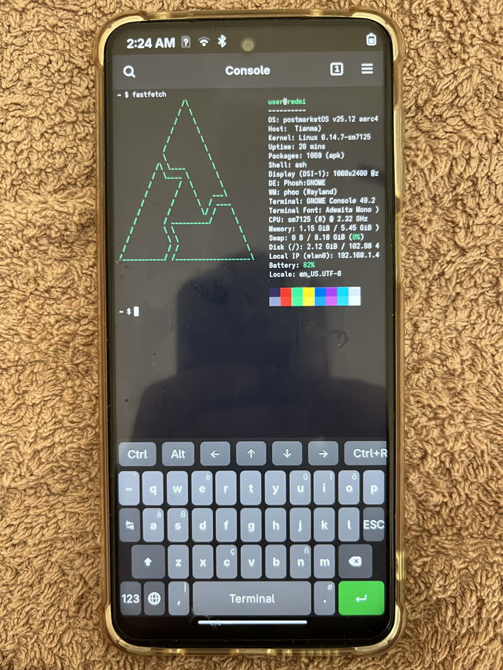
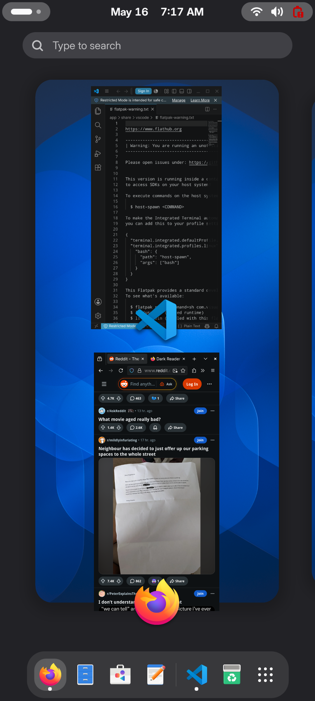
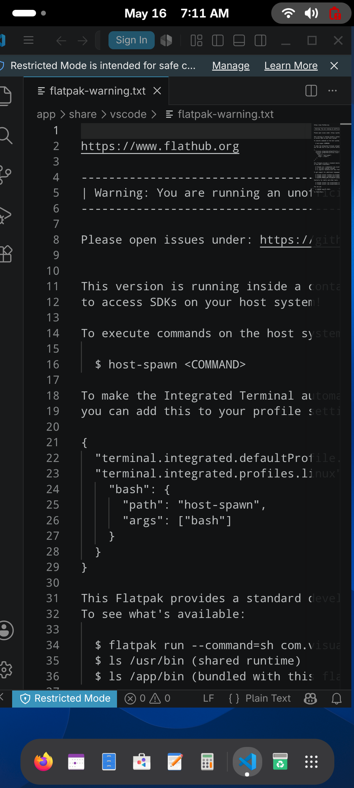
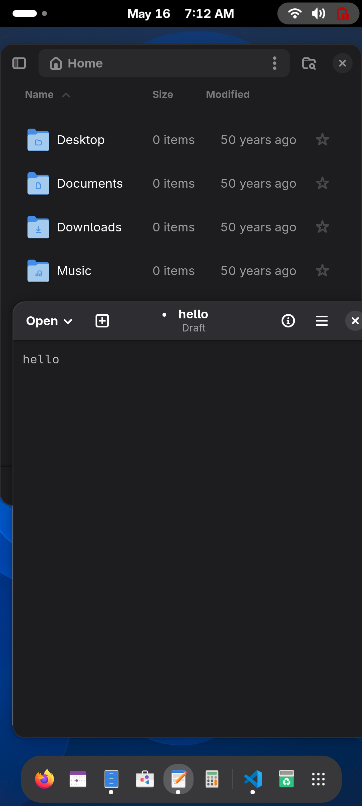

# Xiaomi Redmi Note 9S → postmarketOS

Pre-built **postmarketOS v25.12 + Phosh** flash bundle for the **Xiaomi Redmi Note 9S** (pmaports codename `xiaomi-miatoll`, SKU `curtana`). Likely also works on the **Redmi Note 9 Pro** (`joyeuse`) and **Note 9 Pro Max** (`excalibur`) — same miatoll family, untested by me. **~10 minutes to lockscreen.** Ships with the Plymouth workaround you'll otherwise hit at the pmOS logo + "Loading…" forever. The same hardware also runs classic GNOME on edge (see second row).

**Phosh** (this bundle):

| Lockscreen | App drawer | Console + fastfetch |
|:---:|:---:|:---:|
|  |  |  |

**Classic GNOME on edge** (`pmbootstrap config ui gnome` + `is_default_channel True`):

| Activities overview | VSCode (dark) | Firefox | Files + Editor |
|:---:|:---:|:---:|:---:|
|  |  |  |  |

## Download

```sh
git clone https://github.com/asidko/redmi-note-9s-postmarketos
cd redmi-note-9s-postmarketos
./download.sh                  # grabs binaries from the latest release, decompresses, verifies
```

`download.sh` fetches the four files below from **[GitHub Releases](../../releases/latest)** (they don't live in git — GitHub's hard limit is 100 MB per file).

| File | Size | Compressed | Goes to |
|---|---|---|---|
| `xiaomi-miatoll-boot.img` | 256 MiB | `.img.zst` ~25 MB | `cache` *(kernel partition on miatoll)* |
| `xiaomi-miatoll-root.img` | 2.5 GiB | `.img.zst` ~800 MB | `userdata` |
| `u-boot-sm7125.img` | 1008 KiB | not compressed | `boot` *(mainline U-Boot for SM7125)* |
| `SHA256SUMS` | — | — | integrity check |

## ⚠️ Read first

- **Destructive.** Wipes `cache`, `userdata`, `boot`. Modem, persist, keymaster, devcfg, `super` survive — radio works, revert to MIUI possible.
- **Tested on Redmi Note 9S** (`curtana`). The same images may work on `joyeuse` / `excalibur` (Note 9 Pro / Pro Max — miatoll family) but are untested there.
- **Never flash `*-boot.img` to `boot`** — on miatoll, `cache` = kernel, `boot` = U-Boot. Swap = brick.
- Battery ≥ 30 %. No power-cycle mid-flash.

## Prerequisites

**Laptop:** Linux + `fastboot` (`apt install android-tools-fastboot android-sdk-platform-tools-common`, or your distro's equivalent) + `zstd`. Optional but recommended: `gh` (GitHub CLI) — `download.sh` uses it for faster, resumable transfers if present, otherwise falls back to `curl`. USB data cable. Run fastboot with `sudo` if udev rules aren't installed.

**Phone — bootloader must be unlocked.** Three steps, 5–7 days total:

0. **Sign in to <https://account.xiaomi.com/>** — confirm the Mi account is active, signed in on the phone, with a verified email (Xiaomi rejects unlock requests without one).
1. **Submit the unlock request** (cross-platform): <https://github.com/offici5l/MiUnlockTool>
2. **Wait 5–7 days** (Xiaomi-account-age gated, no skip).
3. **Do the unlock** (Windows-only, official): <https://en.miui.com/unlock/download_en.html>

Verify: `fastboot oem device-info` shows `Device unlocked: true`.

## Flash

You're already in the cloned repo folder from the **Download** step above — the next commands run from there. `download.sh` already verified checksums; re-run `sha256sum -c SHA256SUMS` only if you suspect corruption.

Power phone off → hold **Volume DOWN + Power** to fastboot → plug USB.

```sh
fastboot devices                                       # one line expected
fastboot getvar product                                # must say: product: curtana
```

Stop if `product` is anything other than `curtana` (`joyeuse` / `excalibur` are Note 9 Pro / Pro Max — likely OK but untested).

```sh
fastboot flash cache    xiaomi-miatoll-boot.img        # ~10 s
fastboot flash userdata xiaomi-miatoll-root.img        # ~60–120 s, 3 sparse chunks
fastboot erase dtbo                                    # mainline kernel ignores it; clearing stock dtbo avoids stale data
fastboot flash boot     u-boot-sm7125.img              # ~1 s
fastboot reboot
```

USB drops — that's normal. On the phone you'll see U-Boot text (~5 s) → pmOS logo → **scrolling boot logs** (intentional, see build notes) → Phosh lockscreen in **1–5 min** on first boot.

## Login

| | |
|---|---|
| User | `user` |
| Password | `1234`  (also sudo) |
| Hostname | `redmi` |

SSH is enabled by default. On the phone connect Wi-Fi, find the IP via Terminal: `hostname -I`. Then from your PC:

```sh
ssh user@<phone-ip>       # password: 1234
ssh user@redmi.local      # mDNS — macOS and most Linux work out of the box
```

**🔒 Change the password immediately** — `passwd` over SSH, or Settings → Users in Phosh. `1234` is unsafe.

## Hardware support

`xiaomi-miatoll` is **testing** tier in pmaports. Works: Wi-Fi, cellular voice + data, audio, GPU, sensors. Broken/missing: camera, fingerprint, NFC, HW video decode. Wiki: <https://wiki.postmarketos.org/wiki/Xiaomi_Redmi_Note_9S_(xiaomi-miatoll)>.

### Battery readings (UI-dependent)

The mainline `qcom_qg` fuel-gauge driver reports nonsense for the first few seconds after boot (`capacity=0`, `status=Unknown`) before it settles. The three pmOS UIs handle this differently:

- **Phosh** ✅ — ignores transient readings, works correctly.
- **Plasma Mobile / GNOME Mobile** ⚠️ — their power daemons (`PowerDevil` / `gnome-settings-daemon`) act on the first reading and trigger `critical-battery-action`, which by default **shuts the phone off seconds after boot**.

If you flash this bundle and pick anything other than Phosh, override the critical-battery action over SSH:

```sh
# GNOME Mobile
gsettings set org.gnome.settings-daemon.plugins.power critical-battery-action 'nothing'

# Plasma Mobile
kwriteconfig5 --file powerdevilrc --group BatteryManagement --key BatteryCriticalAction 0
```

The setting persists across reboots. The on-screen indicator may still briefly show 0% at boot, but the phone won't shut down on you.

### Charging fix (mainline PM6150 SMB5)

Separate problem from the boot-transient one above: on this kernel, mainline has **no charger driver bound to PM6150's SMB5 peripherals**, so the bootloader-default input current limit (≈ 500 mA SDP fallback) leaves the phone losing charge while plugged in with the screen on. The fuel gauge's `STATUS` is also stuck on `Unknown`, so GNOME shows `battery-missing-symbolic`.

Both are fixed by a companion repo: **<https://github.com/asidko/pm6150-charger-mainline>** — two out-of-tree modules and a 4-line `qcom_qg` patch. Precompiled `.ko` files for this exact bundle's kernel are attached to the [latest release](https://github.com/asidko/pm6150-charger-mainline/releases/latest). After install, charging draws ~700–750 mA at 5 V, the bolt icon shows, and termination at 100 % SoC is enforced.

## Troubleshooting

- **`fastboot devices` empty / "no permissions":** bad/charge-only cable, missing udev, or run with `sudo`.
- **"Volume Full" on flash:** image corrupted — re-run `sha256sum -c` and re-download.
- **Black screen > 7 min:** hold Power 10 s. If dead, Vol-Down + Power → restart from the verify step. **Vol-Up + Power is MIUI recovery, NOT EDL** on this device.
- **Stuck on pmOS logo + "Loading…":** you're on a build without the Plymouth fix. This bundle has it baked in — re-flash `cache` from this release.
- **No Wi-Fi:** `firmware-xiaomi-miatoll` is included; reboot once. Check `dmesg | grep firmware` over SSH.

## Build notes (for rebuilders)

`pmbootstrap` v3.10.1, `pmaports` `v25.12`, channel `systemd-v25.12`, Alpine aarch64 cross-build. Two non-default changes are required:

1. **Smaller `boot_size`** — miatoll's `cache` is only ~384 MiB, but pmbootstrap defaults to 512 MiB and refuses smaller. Patch `sanity_check_boot_size()` in `pmb/install/_install.py` to allow `< 512` with a warning, then `pmbootstrap config boot_size 256`.
2. **Plymouth disabled in kernel cmdline** — mainline Plymouth hangs on miatoll's DRM driver (boot stalls at the pmOS logo forever). Mount the generated `xiaomi-miatoll-boot.img` and edit `/loader/entries/pmos.conf`: replace `quiet loglevel=2` with `plymouth.enable=0 console=tty0 systemd.show_status=true` (verbose flags are optional but useful — this bundle keeps `loglevel=7` and the systemd info logging so on-screen debugging is possible).
